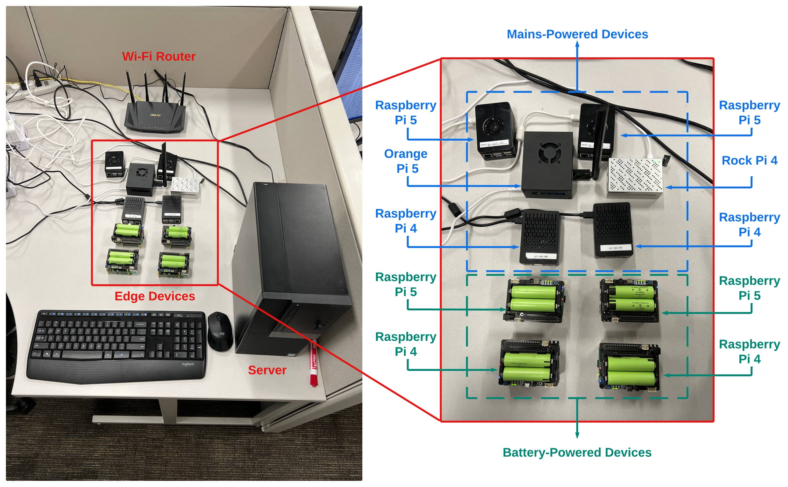

# [TMC] SPFERE: Towards Practical Semi-synchronous On-device Federated Edge Learning with Fairness and Power Awareness

[](#license) []() [](https://doi.org/10.1109/TMC.2025.3649621)

## Overview

This repository contains the source code and minimal usage examples supporting our research work.:

> **SPFERE: Towards Practical Semi-synchronous On-device Federated Edge Learning with Fairness and Power Awareness**  
>
> Yixin Chen, Yifan Guo and Wei Yu
> 
> Accepted in IEEE Transactions on Mobile Computing
>
> DOI: [https://doi.org/10.1109/TMC.2025.3649621](https://doi.org/10.1109/TMC.2025.3649621)

This work focuses on **a semi-synchronous fairness-and-power-aware FEL framework with a co-design for learning and communication**, and proposes **SPFERE**, a <ins>S</ins>emi-synchronous <ins>P</ins>ower-aware and <ins>F</ins>airn<ins>E</ins>ss-<ins>R</ins>egulated <ins>E</ins>ngine, designed for power-constrained edge environments and implemented on both a real-world edge testbed and a simulation platform to support asynchronous model updating, power management, and fairness-aware model aggregation.

## Table of Contents
- [Features](#features)
- [Requirements](#requirements)
- [Setup Steps](#setup-steps)
- [Experimental Evaluation](#experimental-evaluation)
- [License](#license)
- [Citation](#citation)

## Features
- **Modular framework** for federated edge learning with on-device AI designs.
- **Extensible and reproducibility-oriented execution framework** supporting both on-device and simulated experiments, with experimental design and parameters described in the accompanying paper.
- **Support for heterogeneous real-world devices** including Raspberry Pi-class edge nodes and GPU-backed servers.

## Requirements

### Software Prerequisites
- Linux based system with __Python ≥ 3.10__
  - Server Side: Ubuntu 22.04 LTS (or newer) is preferred
  - Client Side: Linux based system supporting Python ≥ 3.10 will be good
    - Raspberry Pi OS 64 bit (Bookworm)
    - [Official Orange Pi OS](https://drive.google.com/drive/folders/1wOmKUla8CwUPTfxvfCGutj8lbMZFtFCm) Ubuntu Jammy Desktop Customised version ([direct official link](https://drive.google.com/file/d/169uJhhYhsNVj37iqYzT2OwwTT5Wd3WLt/view?usp=drive_link))
    - [Official Radxa-built system images for ROCK 4C+](https://github.com/radxa-build/rock-4c-plus/releases) bookworm kde version
- PyTorch ≥ 2.5, torchvision, pandas, numpy, scipy, etc.

### Experimental Hardware Setup

- On-device Side Hardware
  - Server: Dell OptiPlex 7060, Intel(R) Core(TM) i7-8700 CPU, 32GB Memory, Non-GPU
  - Client: 
    - Raspberry Pi 5 8GB * 4 (2 battery powered)
    - Raspberry Pi 4B 8GB * 4 (2 battery powered)
    - Orange Pi 5 Plus 16GB * 1
    - Rock 4C+ * 1
  - 2.4GHz WiFi Router, server wire connected, clients wireless connected
  - [GeekWorm X728 shield](https://wiki.geekworm.com/X728-script) as batter power supply, using 18650 * 2


- Simulation Side Hardware: We utilized Nvidia Ada6000 48GB for acceleration.

## Setup Steps

### On-device Steps

Use [Raspberry Pi Imager](https://www.raspberrypi.com/software/#:~:text=powers%20our%20technology-,Raspberry%C2%A0Pi%20Imager,-Raspberry%C2%A0Pi%C2%A0Imager) to install the 64 bit Raspberry Pi OS on your Raspberry Pi 4B/5, newer Trixie should work well. Use [balenaEtcher](https://etcher.balena.io/) to burn the image to the other SBCs. SSH needs to be enabled for headless remote control. It is suggested to __setup ssh public/private key pairs__ on the server and clients for __non-password SSH connection__. Otherwise, the batch scripts on the server side will not working smoothly, prompting the user to enter password again and again. __Also, it is not safe enough to use password authentication.__

After the OS is installed. Make sure the server and all the clients are connected to the router. It is recommended to set static IP for all the devices.

#### Unified Steps
```bash
# clone our repositories and enter the folder
git clone https://github.com/YixinChenYC1999/SPFERE
cd SPFERE
```

#### Server Side

__Note:__ Server side code should be run before any client.

```bash
# server side setup with creating an venv named server_venv
chmod +x scripts/on_device/server/server_setup.sh
bash scripts/on_device/server/server_setup.sh

# run the server side code
bash scripts/on_device/server/server_test.sh
```

More server side config can be modified in ```src/chen2026spfere/server/server_config.py```.

#### Client Side

```bash
# client side setup with creating an venv named client_venv
# read the inline comments of line 45-46 
#      if you will use smbus for dynamic power monitoring with X728
#      you will also need to enable i2c module in raspi-config
chmod +x scripts/on_device/client/client_setup.sh
bash scripts/on_device/client/client_setup.sh
```

When setting up the client side environment, the script will prompt the user to input the client information, which will be saved in ```src/chen2026spfere/client/client_info.py```. This is used for client registration on the server.

__IMPORTANT:__ You will need to update following several files in folder ```src/chen2026spfere/client/``` to correctly connect to the server.

- ```src/chen2026spfere/client/client_config.py```
  - line 3, change to your server ip
  - line 18, change to your related client id, in default, this should be the same as your client hostnames. You can change your data distribution and ratio here.
- ```src/chen2026spfere/client/client_bat.py```
  - if you are using the same X728 hardware and you would like to monitor the remain power voltage, follow the inline comments to uncomment line 1-15 and then comment the rest.
- ```src/chen2026spfere/client/client.py```
  - line 25, change to your related client id as in ```client_config.py```

After these necessary change are done, and the server is started, you can start the clients by running:

```
# run the client side code
bash scripts/on_device/client/client_test.sh
```

More client side config can be modified in ```src/chen2026spfere/client/client_config.py```.

#### Batch Scripts on the Srever Side to Run All Clients

Carefully modify the ```CLIENTS``` (line 21) in ```scripts/on_device/server/batch_run_all_clients.sh```. The clients' alias should be what you setup for the SSH key connection (e.g., ```user@raspi4-01``` or ```user@192.168.0.101```). 

Then make sure all the clients share the same relative path to the current home folder. The repo folder should be at the path of ```~/the/repo/folder```. And ```REMOTE_DIR``` (line 35) of this file need be modified to ```the/repo/folder```. Otherwise, this batch script will not work.

__Note:__ Server side code should be run before any client.

```
bash scripts/on_device/server/batch_run_all_clients.sh
```

All clients output will be tailed to server side as ```server_log/za_output_${CLIENT_alias}.log```.

### Simulation Steps

```bash
# clone our repositories and enter the folder
git clone https://github.com/YixinChenYC1999/SPFERE
cd SPFERE

# setup with creating an venv named sim_venv
chmod +x scripts/simulation/sim_setup.sh
bash scripts/simulation/sim_setup.sh

# run the simulation with default settings
bash scripts/simulation/sim_test.sh
```

To customise the configs, you can add arguments to ```scripts/simulation/sim_test.sh``` (line 24).

```
# sample command for line 24
python -m chen2026spfere.simulation.sim --GPU_ID 0 --USE_MODEL resnet20 --CLIENT_NUMBER 50 --WAIT_UNTIL_M 50
```

Accepted arguments are listed as follows:

```
# accepted arguments
GPU_ID = "0" # Assign GPU ID, e.g., GPU_ID = "1" means use GPU 1
USE_MODEL = "SimpleCNN"   # SimpleCNN BetterCNN ShuffleCNN EfficientCNN get_resnet18_cifar10 resnet20
                          # SimpleCNN_FM is only used when f_mnist is used
DATASET = "cifar10" # "cifar10" or "stl_10" or "eurosat_rgb" or "svhn" or "f_mnist"
TRAIN_ROUND = 40
CLIENT_NUMBER = 20 # number of clients
WAIT_UNTIL_M = 5  # wait-until-M, only useful when sync and M is less than client number

G_LR = 1 # global learning rate
AGGR_METHOD = "fedavg" # fedavg q_fel f_div f_mul f_add
Q_FEL = 1 # q value
TOP_K = None

CLIENT_BATCH_SIZE = 128 # batch size for training dataset at client
CLIENT_EPOCHS = 2 # local epoch
TRAIN_LOADER_MODE = "dirichlet" # avg or dirichlet
CLIENT_ALPHA_LOW = 0.1 # alpha in dirichlet distribution
CLIENT_ALPHA_HIGH = 5 # alpha range

CLIENT_USE_OPTIMIZER = "sgd" # client train optimizer, sgd or adam
CLIENT_LR = 0.01 # client train lr
CLIENT_LR_GAMMA = 1.0 # client train lr decay gamma

SERVER_BATCH_SIZE = 128 # batch size for testing dataset at server
TEST_SEED = 42
TEST_LOADER_MODE = "avg" # avg or dirichlet (checked - no issues)
TEST_ALPHA = 0.1 # only active when dirichlet is used

PRECISION_COMPRESSION = False   # True or False
PRECISION_DTYPE = "fp16"        # "fp16" | "bf16"
KEEP_NORM_FP32 = True           # True or False
AGGR_ACCUM_FP32 = True          # True or False
```


## Experimental Evaluation

Section VI (Performance Evaluation) of the paper outlines the experimental settings, while the precise parameters for each experiment are detailed in the corresponding results tables (including captions and table contents).

## License

This project is licensed under **The MIT License (MIT)**.

```
The MIT License (MIT)

Copyright (c) 2025 Yixin Chen.

Permission is hereby granted, free of charge, to any person obtaining a copy of
this software and associated documentation files (the "Software"), to deal in
the Software without restriction, including without limitation the rights to
use, copy, modify, merge, publish, distribute, sublicense, and/or sell copies of
the Software, and to permit persons to whom the Software is furnished to do so,
subject to the following conditions:

The above copyright notice and this permission notice shall be included in all
copies or substantial portions of the Software.

THE SOFTWARE IS PROVIDED "AS IS", WITHOUT WARRANTY OF ANY KIND, EXPRESS OR
IMPLIED, INCLUDING BUT NOT LIMITED TO THE WARRANTIES OF MERCHANTABILITY, FITNESS
FOR A PARTICULAR PURPOSE AND NONINFRINGEMENT. IN NO EVENT SHALL THE AUTHORS OR
COPYRIGHT HOLDERS BE LIABLE FOR ANY CLAIM, DAMAGES OR OTHER LIABILITY, WHETHER
IN AN ACTION OF CONTRACT, TORT OR OTHERWISE, ARISING FROM, OUT OF OR IN
CONNECTION WITH THE SOFTWARE OR THE USE OR OTHER DEALINGS IN THE SOFTWARE.
```

## Citation

If you use this code or data in your research, please cite our paper:

```
@ARTICLE{chen2026spfere,
  author={Chen, Yixin and Guo, Yifan and Yu, Wei},
  journal={IEEE Transactions on Mobile Computing}, 
  title={SPFERE: Towards Practical Semi-Synchronous On-Device Federated Edge Learning With Fairness and Power Awareness}, 
  year={2025},
  volume={},
  number={},
  pages={1-18},
  keywords={Training;Computational modeling;Protocols;Servers;Data models;Performance evaluation;Mobile computing;Estimation;Convergence;Power system management;Fairness-aware model aggregation;federated edge learning;learning and communication co-design;power management;semi-synchronous on-device training},
  doi={10.1109/TMC.2025.3649621}
}
```